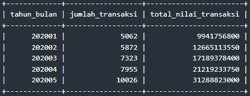
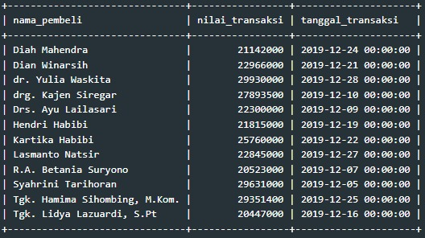
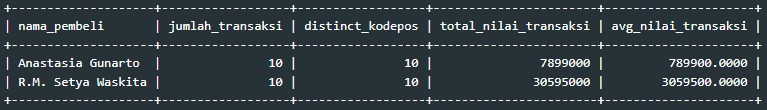
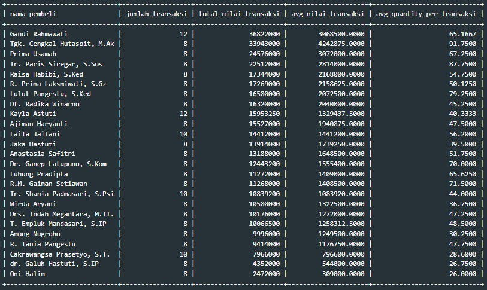
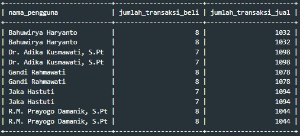
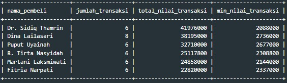
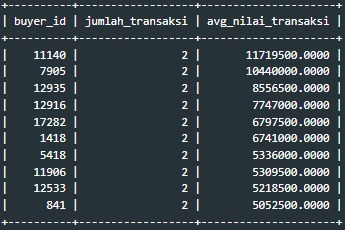
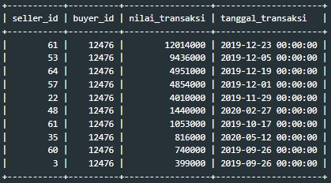

# 🛒 DQLab Store: E-Commerce Ecosystem & User Segmentation Analysis


---

## 📌 Project Overview
**DQLab Store** is a dynamic **C2C (Consumer-to-Consumer) marketplace** where users can act as both buyers and sellers.  
The core challenge is to disentangle these overlapping roles to identify distinct user segments—such as **Dropshippers** and **Resellers**—while evaluating overall sales health.

This project transforms **raw transactional data** into actionable business intelligence by analyzing:
- **User Behavior:** Distinguishing between end-consumers, dropshippers, and bulk resellers.
- **Sales Trends:** Tracking hyper-growth phases and seasonal anomalies (e.g., Year-End spikes).
- **Operational Health:** Auditing payment settlement latencies and system constraints.

The goal is to move beyond simple sales reporting to **behavioral segmentation** that drives targeted retention strategies.

---

## 🎯 Business Objectives
📈 **Macro Trend Analysis** Evaluate sales momentum, revenue growth, and category performance during H1 2020.

👥 **Ecosystem Segmentation** Isolate specific business models (Dropshippers vs. Resellers) using shipping pattern logic.

💎 **High-Value User Profiling** Identify "Whale" clients and analyze their seasonal spending habits for retention targeting.

⚙️ **Operational Efficiency** Assess cash flow velocity by tracking payment settlement duration (SLA).

---

## 🗂️ Dataset Overview

### 👥 User & Transaction Tables
**Tables**: `users`, `orders`, `order_details`, `products`

| Table | Key Columns | Description |
|-------|-------------|-------------|
| **users** | `user_id`, `kodepos`, `nama_user` | Registered user profiles and primary addresses. |
| **orders** | `order_id`, `buyer_id`, `seller_id`, `total` | Transaction headers linking buyers and sellers. |
| **order_details** | `product_id`, `quantity`, `price` | Granular item-level data per transaction. |
| **products** | `product_id`, `category`, `base_price` | Product catalog and classification. |

---

## 🛠️ Tools & Techniques
- **Language**: MySQL  
- **Techniques**:
  - **Complex JOINS**: Merging 4 relational tables.
  - **Pattern Detection**: Using `HAVING COUNT(DISTINCT)` for behavioral logic.
  - **Temporal Analysis**: `EXTRACT(YEAR_MONTH)` & `DATEDIFF` for time-series insights.
  - **Derived Tables**: Subqueries for hybrid user analysis.

---

## 🔍 Analysis & Key Insights

## 📊 1. Store Performance & Trends

### 🅐 Monthly Sales Trend (H1 2020)
*Tracking transaction volume and revenue growth from Jan to May 2020.*

#### 🧩 SQL Query
```sql
SELECT 
    EXTRACT(YEAR_MONTH FROM created_at) as tahun_bulan, 
    count(1) as jumlah_transaksi, 
    sum(total) as total_nilai_transaksi
FROM orders
WHERE created_at >= '2020-01-01'
GROUP BY 1
ORDER BY 1;
```

### 📈 Output



💡 Key Business Insights

🚀 Transaction volume doubled (+98%) and revenue tripled from Jan to May 2020.

💰 Revenue growing faster than volume indicates a significant increase in Average Order Value.

✅ Positive month-over-month growth with zero downturns.

### 🅑 Peak Season Anomaly (Dec 2019)
Identifying high-value transactions (> 20 Million IDR) during the year-end period.

### 🧩 SQL Query
```sql
SELECT 
    u.nama_user AS nama_pembeli, 
    o.total AS nilai_transaksi, 
    o.created_at AS tanggal_transaksi
FROM orders o
JOIN users u ON o.buyer_id = u.user_id
WHERE o.created_at BETWEEN '2019-12-01' AND '2019-12-31'
AND o.total >= 20000000
ORDER BY 1 ASC;
```
### 📈 Output



💡 Key Business Insights

📅 The surge of >20M transactions in December validates a "Year-End Spending" phenomenon.

🐳 These are not retail buyers; they are likely B2B partners stocking up for the holidays.

### 🅒 Top Performing Categories (2020)
Ranking the top 5 product categories by sales volume.

### 🧩 SQL Query
```sql
SELECT 
    category, 
    sum(quantity) as total_quantity, 
    sum(quantity*price) as total_price
FROM orders
INNER JOIN order_details using(order_id)
INNER JOIN products using(product_id)
WHERE created_at >= '2020-01-01'
AND delivery_at IS NOT NULL
GROUP BY 1
ORDER BY 2 DESC
LIMIT 5;
```

### 📈 Output


💡 Key Business Insights

🧼 "Kebersihan Diri" Personal Care sold ~944k units, 3x more than the runner-up category.

📉 While "Makanan Instan" is high volume, "Fresh Food" drives significantly higher revenue margins.

---

## 👥 2. User Ecosystem & Segmentation

### 🅐 Identifying Dropshippers (Pattern Detection)
Users with high transaction count but 100% unique shipping addresses.

### 🧩 SQL Query
```sql
SELECT
    nama_user as nama_pembeli,
    count(1) as jumlah_transaksi, 
    count(distinct orders.kodepos) as distinct_kodepos,
    sum(total) as total_nilai_transaksi
FROM orders 
INNER JOIN users ON buyer_id = user_id 
GROUP BY user_id, nama_user
HAVING count(1) >= 10 
AND count(1) = count(distinct orders.kodepos)
ORDER BY 2 DESC;
```

### 📈 Output



💡 Key Business Insights

📦 Users like Anastasia Gunarto show a perfect 1:1 ratio (10 orders sent to 10 different locations), confirming Dropshipper status.

🤝 These users are intermediaries. Offer them white-label packaging services to increase loyalty.

### 🅑 Identifying Offline Resellers (Inventory Stocking)
Users with high volume, bulk quantity, and a single shipping address.

### 🧩 SQL Query
```sql
SELECT
    nama_user as nama_pembeli,
    count(1) as jumlah_transaksi, 
    avg(total_quantity) as avg_quantity_per_transaksi
FROM orders 
INNER JOIN users ON buyer_id = user_id 
INNER JOIN (SELECT order_id, sum(quantity) as total_quantity FROM order_details GROUP BY 1) as summary_order USING(order_id)
WHERE orders.kodepos = users.kodepos
GROUP BY user_id, nama_user
HAVING count(1) >= 8 AND avg(total_quantity) > 10
ORDER BY 3 DESC;
```

### 📈 Output



💡 Key Business Insights

🏭 Gandi Rahmawati buys avg 65 items/transaction sent to the same address. This is clear B2B restocking behavior.

🚚 Provide bulk shipping discounts or dedicated account management for these high-volume logistics users.

### 🅒 Hybrid User Analysis (Buyer-Seller)
Power Sellers who also actively participate as buyers.

### 🧩 SQL Query
```sql
-- (Simplified for brevity, uses Derived Tables for Buyer/Seller counts)
SELECT nama_user, jumlah_transaksi_beli, jumlah_transaksi_jual
...
WHERE jumlah_transaksi_beli >= 7
ORDER BY 1;
```

### 📈 Output



💡 Key Business Insights

🔄 Top sellers (1000+ sales) who buy occasionally are likely conducting competitor analysis or personal shopping.

### 🅓 High-Value Customer Segmentation (VIPs)
Loyalists with > 5 transactions where EVERY transaction exceeds 2 Million IDR.

### 🧩 SQL Query
```sql
SELECT nama_user, count(1), sum(total), min(total)
...
HAVING count(1) > 5 AND min(total) > 2000000
ORDER BY 3 DESC;
```

### 📈 Output



💡 Key Business Insights

💎 Users like Dr. Sidiq Thamrin (Total 42M) are consistent big spenders. Losing them would significantly impact revenue.

### 🅔 Seasonal High-Rollers (Jan 2020)
Top spenders who showed consistent purchasing power in Jan 2020.

### 🧩 SQL Query
```sql
SELECT buyer_id, count(1), avg(total)
...
WHERE created_at BETWEEN '2020-01-01' AND '2020-02-01'
HAVING count(1) >= 2
ORDER BY 3 DESC LIMIT 10;
```
### 📈 Output



💡 Key Business Insights

📅 Top users in Jan 2020 averaged >11M IDR per transaction, indicating strong fiscal year opening budgets.

---

## ⚙️ 3. Operational & Behavioral Deep Dive

### 🅐 Payment Settlement Latency
Calculating average time lag between order creation and payment.

### 🧩 SQL Query
```sql
SELECT
    EXTRACT(YEAR_MONTH from created_at) as tahun_bulan,
    avg(datediff(paid_at, created_at)) as avg_lama_dibayar,
    max(datediff(paid_at, created_at)) as max_lama_dibayar
FROM orders 
WHERE paid_at IS NOT NULL 
GROUP BY 1;
```

### 📈 Output


💡 Key Business Insights

⏱️ The max_lama_dibayar is consistently 14 days, indicating a strict auto-cancellation system policy.

💵 Average settlement time is stable at ~7.5 days.

### 🅑 Single-User Deep Dive (User 12476)
Micro-analysis of a specific high-value buyer.

### 🧩 SQL Query
```sql
SELECT seller_id, buyer_id, total, created_at
FROM orders
WHERE buyer_id = 12476
ORDER BY 3 DESC LIMIT 10;
```

### 📈 Output



💡 Key Business Insights

📉 This user's top 4 largest transactions ALL occurred in December 2019, perfectly validating the macro "Year-End Spending" trend identified in Section 1B.
